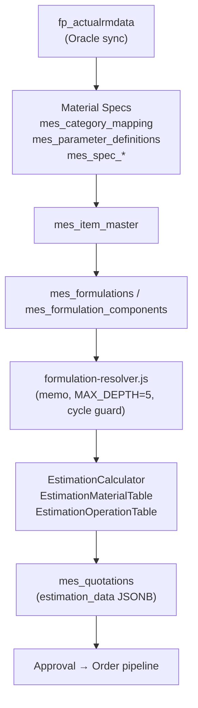

# ProPackHub (PEBI) — Comprehensive Project Map & Audit
**Version:** 26.4 · **Generated:** 2026-04-24 · **Scope:** Full-stack architecture, MES Material Specs, PDF parser, Item-Master/Costing data flow, code-quality audit.

> **Purpose** — Single source of truth for any AI/human agent joining a session. Lets a session start *without* re-exploring the codebase.
> **Read order:** §1 (orientation) → §2 (your domain) → §13 (live issues board).
> **Companion docs (always cross-check):** [PROJECT_CONTEXT.md](PROJECT_CONTEXT.md), [SESSION_LOG.md](SESSION_LOG.md), [TECH_DEBT.md](TECH_DEBT.md), [API_CONTRACTS.md](API_CONTRACTS.md), [LIVE_STATE.md](LIVE_STATE.md).

---

## 1. Orientation

### 1.1 Product
- **Internal name:** PEBI (Packaging Enterprise Business Intelligence) — public name **ProPackHub**.
- **Industry:** Flexible Packaging (films, laminates, labels, shrink, sleeves).
- **Scope:** SaaS multi-tenant ERP-adjacent system. Default tenant: **Interplast (UAE)**; default division: **FP**.
- **Modules:** MIS Dashboards · CRM · MES (PreSales → JobCard → Production → QC) · Material Specs / Master Data · AEBF (Actual/Estimate/Budget/Forecast) · Settings/RBAC · SaaS Platform Admin.

### 1.2 Stack
| Layer | Tech | Port |
|---|---|---|
| Frontend | React 18 + Vite 7 + Ant Design 5 + @tanstack/react-query | **3000** |
| Backend | Express 4.18 + Node 20 + `pg` + Redis | **3001** |
| Databases | PostgreSQL 14 (3 named DBs, see §1.5) | 5432 |
| ERP sync | `oracledb` (read-only) + Excel import | — |
| Auth | JWT access (15 min) + refresh (60 d, HTTP-only cookie) | — |
| Tests | Jest (backend) + Playwright (E2E) | — |

### 1.3 Boot
```bat
START-SERVERS.cmd   :: kills 3000/3001 → starts server (npm run dev) → waits → starts frontend (npm start)
```
Logs: `logs/backend-3001.log`, `logs/frontend-3000.log`.
Dev login: `camille@interplast-uae.com` / `Admin@123`.

### 1.4 Workspace root
`d:\PPH 26.4\PPH\` (the application). The parent `d:\PPH 26.4\` holds external docs / Excel inputs (`Sistrade_ERP_FlexiblePackaging_KnowledgeBase.md`, `extract_pdf.js`, `documents/`).

### 1.5 Databases & pools (`server/database/config.js` — **canonical**, do *not* use `server/config/database.js` legacy)
| DB | Purpose | Pool var |
|---|---|---|
| `fp_database` | Business data (FP) — `fp_*`, `crm_*`, `mes_*`, `qc_*`, `mv_fp_sales_cube` | `pool` |
| `ip_auth_database` | Users, sessions, company settings, employees, countries | `authPool` |
| `propackhub_platform` | SaaS tenants, plans, platform users | `platformPool` |
| `{division}_database` (e.g. `hc_database`) | Per-division replica of fp_database | `getDivisionPool(code)` |

Pool tuning: max 20, idleTimeout 30 s, connTimeout 10 s.

---

## 2. Repository Layout

```
PPH/
├── src/                     # React SPA (≈330 .jsx)
├── server/                  # Express API
│   ├── routes/              # 52 route files (+ mes/, crm/, presales/ subfolders)
│   ├── services/            # 44+ domain services
│   ├── middleware/          # 18 (auth, rateLimiter, cache, errorHandler, security, …)
│   ├── database/config.js   # Pool factory (CANONICAL)
│   ├── utils/               # tds-pdf-parser.js, schema-pdf-parser.js, formulation-resolver.js, logger.js
│   ├── jobs/                # Cron + background workers
│   ├── migrations/          # ~120 numbered .js + sql/.up/.down
│   └── tests/               # Jest unit + integration
├── migrations/sql/          # Versioned SQL migrations (parallel to server/migrations/)
├── tests/                   # Playwright E2E
├── docs/                    # **Knowledge base** (this file lives here)
├── public/                  # Static assets
├── uploads/                 # User-uploaded PDFs / photos (served at /uploads, see §11.6)
├── logs/                    # Runtime logs
├── backups/                 # Archived/dead code (excluded from build)
└── .github/                 # CI + Copilot/Cursor instructions
```

### 2.1 Key frontend folders (`src/`)
| Folder | Owns |
|---|---|
| `App.jsx` | Router, **6 nested context providers** (auth-token guards inside each prevent waste — do **not** retry layout-route refactor; regressed CRM 827 ms → 6 595 ms). |
| `components/auth/` | Login, signup. |
| `components/dashboard/` | MIS, sales cockpit, raw materials, exports. |
| `components/CRM/` (76 files) | Field trips, customers, prospects, deals, MyDay, WorkList, ActionsPanel. |
| `components/MES/` (90 files) | PreSales, QC, RawMaterials/views, **MasterData/** (Item Master, TDS, Formulations, BOM, Specs Admin). |
| `components/MasterData/AEBF/` | Actual/Estimate/Budget/Forecast tabs. |
| `components/settings/` | Users, divisions, employees, territories, authorization. |
| `components/people/`, `components/platform/`, `components/reports/`, `components/shared/`, `components/common/` | Org chart, SaaS, exec summaries, common widgets. |
| `contexts/` | 10 contexts incl. AuthContext (30 s pref cache), FilterContext, SalesDataContext, CurrencyContext, ExcelDataContext. |
| `hooks/` | 7 hooks incl. `useSalesCube`, `useDebouncedValue` (400 ms), `useColumnGenerator`. |
| `services/` | 15+ axios wrappers + `deduplicatedFetch.js` + tiered `crmCacheService.js` (30 min historical / 5 min current year). |
| `utils/` | `roleConstants.js`, `roleChecks.js` (canAccess, isTDSWriter), `companyTime.js`, `pagination.js`. |

### 2.2 Key backend areas (`server/`)
- **Entry:** `index.js` → `config/express.js` (middleware order, route mounts).
- **Routes (52):** `auth.js`, `customers.js`, `unifiedUsers.js`, `divisions.js`, `permissions.js`, `authorization.js`, `settings.js`, `currency.js`, `salesData.js`, `productGroups.js`, `territories.js`, `excel.js`, `backup.js`, `rmSync.js`, `fp.js` (Oracle/Excel SSE sync), …
  - `aebf/index.js` (+ subroutes), `crm/*` (12 files), `mes/*` (flow.js, qc-*, presales/, master-data/).
  - `master-data/`: `items.js`, `formulations.js`, `tds.js`, `bom.js`, `machines.js`, `processes.js`, `product-types.js`, `routing.js`, `scheduling.js`, `taxonomy.js`.
- **Services:** `authService`, `userService`, `crmService`, `qcCertificateService`, `OracleERPSyncService`, `migrationRunner`, `AILearningService`, `CausalityEngine`, `PrescriptiveEngine`, `LearningScheduler`, `emailService`, `notificationService`, `mesNotificationService`, `presalesPdfService`, `DocumentationService`, `errorTracking`, etc.
- **Utils:** `tds-pdf-parser.js`, `schema-pdf-parser.js`, `formulation-resolver.js` (memoised, MAX_BOM_DEPTH=5, cycle guard), `logger.js` (Winston — never use `console.*`).
- **Jobs:** `refreshSalesCube.js` (advisory lock), `ERPSyncScheduler.js`, `outlookSyncJob.js`, `outlookWebhookRenewalJob.js`, `crmDailyDigest.js`, `slaBreachChecker.js`.

### 2.3 Migrations
~120 files. Naming: SQL `YYYYMMDD_NNN_*.up.sql`/`.down.sql`; JS `mes-master-NNN-*.js`, `mes-qc-NNN-*.js`. Run via `node server/migrations/run-migration.js`.
Most-recent (selected): `mes-master-050-formulations`, `037-fix-categories`, `036-custom-categories`, `035-rm-column-labels`, `034-param-overhaul`, `033-param-admin-columns`, `032-complete-param-seed`, `031-parameter-definitions`, `030-category-param-tables`, `029-category-mapping`.

---

## 3. Authentication & RBAC

### 3.1 JWT flow
1. `POST /api/auth/login` → `{accessToken (15 min, in body), refreshToken (60 d, HTTP-only cookie)}`.
2. Frontend stores access in **localStorage** (⚠ XSS risk — see §13 H-08), sends `Authorization: Bearer …`.
3. On 401 → `POST /api/auth/refresh` reads cookie → new access.
4. `POST /api/auth/logout` revokes server-side session **but** the refresh cookie is only cleared client-side (§13 M-12).

### 3.2 Role hierarchy (`src/utils/roleConstants.js`)
| Role | Lvl | Capabilities |
|---|---|---|
| admin | 9 | full |
| platform_admin | 8 | SaaS multi-tenant |
| production_manager | 7 | MES, Material Specs, Param Admin |
| sales_manager / manager | 6 | CRM admin, Budget, FieldTrip approval |
| sales_coordinator / mes_manager | 5 | MIS, CRM admin views, MES workflow |
| sales_rep / executive / qc_manager | 4 | rep views, QC dashboard |
| qc_lab / production / accounts_manager | 3 | data entry, job cards, invoicing |
| logistics / stores | 2 | dispatch, RM store |

### 3.3 Permission middleware
`server/middleware/auth.js` (`authenticate`, `requireRole(role)`), `requirePermission.js`, `requireAnyRole.js`. Permission matrix in `server/services/permissionService.js`.

### 3.4 Tenant scoping
Most queries default to FP and accept `?division=` query param. **Critical gap:** routes in `analytics.js`, `confirmedMerges.js`, `ai-learning.js`, parts of `pl.js` do **not** verify `req.user.divisions` includes the requested division (§13 C-06, C-07, H-09).

---

## 4. MES Module Map

### 4.1 Frontend (`src/components/MES/`)
| Sub-module | Anchors |
|---|---|
| **PreSales** | `CreateJobModal.jsx`, `InquiryDetail/`, `JobCardForm.jsx`, `EstimationCalculator.jsx`, `EstimationMaterialTable.jsx`, `EstimationOperationTable.jsx`, `EstimationSummary.jsx`, `EstimationTotalCost.jsx`. |
| **QC** | `QCSampleAnalysis.jsx`, `QCTemplateAdmin.jsx`, `NCRManagement.jsx`, `SampleProgressSteps.jsx`. |
| **RawMaterials** | `RawMaterialsRouter.jsx`, `RawMaterialsContext.jsx`, `views/{AdminRMView, ManagerRMView, QCIncomingRMView, QCSupplierQualityPanel, ProductionRMView, ProcurementRMView, StoresRMView, RegrindBatchModal}.jsx`. |
| **MasterData** | `ItemMaster.jsx`, `MasterDataHub.jsx`, `TDSManager.jsx`, `MaterialSpecsAdmin.jsx`, `CustomCategories.jsx`, `FormulationEditor.jsx` (universal multi-level BOM), `BOMConfigurator.jsx`, `BOMStructureTab.jsx`, `BOMEstimationPreview.jsx`, `ParameterSchemaAdmin.jsx`. |
| **Workflow** | `WorkflowLandingPageMain.jsx` + `constants.js` role config. |

### 4.2 Backend (`server/routes/mes/`)
- `flow.js` — job state machine.
- `presales/` (~30 files): inquiries, quotes, jobs, estimation, customers, products.
- `qc-incoming-rm.js`, `qc-certificates.js`.
- `master-data/`: `index.js` (router aggregator) + `formulations.js`, `items.js`, `tds.js`, `bom.js`, `machines.js`, `processes.js`, `product-types.js`, `routing.js`, `scheduling.js`, `taxonomy.js`.

---

## 5. Material Specs / Master-Data Architecture

### 5.1 Schema-driven data model
| Table | Role |
|---|---|
| `mes_category_mapping` | Oracle category → internal `material_class` + `spec_table` link. 12 rows. |
| `mes_parameter_definitions` | Field registry (material_class, profile, field_key, label, unit, type, min/max, sort_order, is_core, is_required). **224 rows seeded** but several profiles still under-seeded (alu_foil 2/26, bopp 2/21, cpp 5/22) → fallback to hardcoded `NON_RESIN_PARAM_RULES` in `tds.js` (~400 lines). |
| `mes_material_tds` | Resin TDS rows (incl. parameters_json + test methods). |
| `mes_spec_substrates`, `mes_spec_adhesives`, `mes_spec_chemicals`, `mes_spec_additives`, `mes_spec_coating`, `mes_spec_packing_materials`, `mes_spec_mounting_tapes` | Per-class spec tables (parameters_json + a few promoted columns like `solids_pct`). |
| `mes_non_resin_material_specs` | **Legacy** — fallback only; phase out target. |
| `mes_item_categories`, `mes_item_category_groups`, `mes_item_group_overrides` | Custom category & grouping logic. |
| `mes_formulations`, `mes_formulation_components` | Multi-level BOM (recursive sub_formulation_id, MAX_DEPTH=5). |
| `fp_actualrmdata` | Live Oracle inventory (read-only). |

### 5.2 API surface (selected)
- `GET /api/mes/master-data/tds/category-mapping`
- `GET /api/mes/master-data/tds/live-material-categories?class_keys=…`
- `GET /api/mes/master-data/tds/live-materials?material_class=…&search=…`
- `GET /api/mes/master-data/tds/parameter-definitions?material_class=…&profile=…`
- `GET /api/mes/master-data/tds/spec-status?material_key=…&material_class=…`
- `GET|PUT /api/mes/master-data/tds/non-resin-spec/:material_key`
- `POST /api/mes/master-data/tds/non-resin-spec/parse-upload`  → returns diff
- `POST /api/mes/master-data/tds/non-resin-spec/bulk-apply`
- `GET|POST|PUT|DELETE /api/mes/master-data/items/...`
- `GET|POST|PUT /api/mes/master-data/formulations/...`

### 5.3 Categories audit (parameter quality)
> Source: `mes_parameter_definitions` + [all_parameter_definitions.json](all_parameter_definitions.json) cross-checked with FP industry norms (ASTM/ISO, internal Extrusion Smart KB).
> Legend: ✅ good · ⚠ wrong/needs change · ❌ missing · ♻ redundant.

#### Resins (14 params)
| field_key | Status | Note |
|---|---|---|
| `density` | ⚠ unit `kg/m³`, range 850–1000 | **Should be `g/cm³` 0.85–1.0** (ASTM D792 convention; conflicts with ALL other density fields stored as g/cm³). |
| `bulk_density` | ⚠ same unit issue (kg/m³ → should be g/cm³ 0.4–0.8). |
| `mfr_190_2_16`, `mfr_190_5_0`, `hlmi_190_21_6`, `mfr_230_2_16_pp`, `melt_flow_ratio`, `crystalline_melting_point`, `vicat_softening_point`, `heat_deflection_temp`, `tensile_strength_break`, `elongation_break`, `brittleness_temp`, `flexural_modulus` | ✅ | All FP-industry standard with proper units & ASTM methods. |
| Missing | ❌ `color_index`, `odor`, `ash_pct`, `volatile_organic_pct`, food-contact compliance flag. |

#### Adhesives (8 params)
| field_key | Status | Note |
|---|---|---|
| `solids_pct`, `density_g_cm3`, `mix_ratio`, `pot_life_min`, `bond_strength`, `cure_time_hours`, `application_temp_c` | ✅ | OK. |
| `viscosity_cps` | ⚠ no temperature/method captured (needs `viscosity_temp_c` + `viscosity_test_method`: Brookfield/Cone&Plate/capillary). |
| Missing | ❌ `nco_pct` (PU 2K), `viscosity_test_method`, `viscosity_temp_c`, `shear_strength_mpa`, `water_content_pct`. |

#### Chemicals (8 — used as Solvents bucket)
| Status | Note |
|---|---|
| ✅ | `purity_pct`, `density_g_cm3`, `boiling_point_c`, `flash_point_c`, `evaporation_rate` (vs nBuAc), `residue_pct`, `solubility`. |
| ⚠ | `viscosity_cps` missing temperature condition. |
| ❌ Missing | `refractive_index`, `surface_tension_dyne_cm`, `water_miscibility_pct`, `kb_value` (explicit, not just evap rate), Hildebrand solvency parameter, retained-solvent ASTM F1378 for flexo. |
| **Architectural gap** | No dedicated **Inks** category — currently lumped into chemicals. Inks need: CIELAB color, retained solvent %, light fastness (ISO 12040), anilox spec. |

#### Additives / Masterbatches (8)
| Status | Note |
|---|---|
| ✅ | `dosage_pct`, `carrier_resin`, `active_content_pct`, `moisture_pct`, `compatibility`. |
| ⚠ | `ash_pct` max=60% — unrealistic for MBs (typical <5%). Looks like copy-paste from foil category. |
| ⚠ | `dispersion_rating` is free-text — should be `dispersion_test_method` + numeric scale (ASTM D5766 Haze for color MBs). |
| ♻ | `carrier_mfi` overlaps with resins MFR. |
| ❌ Missing | `color_l_star/a_star/b_star`, `pigment_type`, `slip_coefficient` (slip MBs), `antiblock_size_micron`, `heat_stability_c`, TiO₂ % for white. |

#### Coating (8)
| Status | Note |
|---|---|
| ✅ | `solids_pct`, `coat_weight_gsm`, `gloss_60deg`, `cure_temp_c`, `adhesion_tape_test`, `cof_after_coating`. |
| ⚠ | `viscosity_cps` missing method/temp; `blocking_tendency` is vague free-text. |
| ❌ Missing | `viscosity_method`, `drying_time_minutes`, color (L*a*b*), abrasion (Taber), `surface_cleanliness_mg_m2`. |

#### Films — generic + 11 profiles
- **Generic (5):** thickness_mic, width_mm, density_g_cm3, cof, corona_dyne — ✅.
- **films_alu_foil (26):** ⚠ over-spec — Si/Fe/Cu/Mn/Mg/Zn/Ti elemental composition (8 fields) is metallurgical OEM cert data, not FP conversion data. ❌ missing: `pinholes_per_m2`, `wettability_dyne_cm`. Otherwise good (alloy, temper, thickness, tensile, elongation, coil geom, test methods).
- **films_alu_pap (12):** ✅ structure (total/alu/paper thickness, grammage), barrier (WVTR/OTR), seal strength. ⚠ `dead_fold` and `surface_finish` free-text. ❌ missing `laminate_bond_strength_n_15mm`.
- **films_bopp (24):** ✅ comprehensive (yield, haze, gloss, tensile MD/TD, elongation MD/TD, COF static/kinetic, corona, shrinkage MD/TD, OTR, WVTR, seal strength, tear MD/TD, SIT, hot tack). ⚠ `treatment_side`/`surface_type` free-text → picklist. ❌ missing `blocking_temp_c`, `dart_drop_g`, `slip_agent_type`, `antistatic_rating`. ♻ `corona_untreated_dyne` redundant if treated side is named.
- **films_cpp (23):** ✅ similar to BOPP. ⚠ `dart_drop_g` unit misnamed; `puncture_resistance_n` ambiguous; `seal_range_temp_c` is text "110–140" — should split to `seal_min_temp_c`/`seal_max_temp_c` numeric. ⚠ `surface_type` free-text. ❌ missing `temp_resistance_c` / max processing temp.
- **films_pet (19):** ✅ core good; ❌ missing SIT/hot tack (PET not sealant); metalised-PET `optical_density`, `metal_bond_strength` exist but field metadata hidden so unclear if mandatory.
- **films_pa (18):** ✅ core good. ⚠ `moisture_content_pct` lacks RH condition (PA absorbs 2–3 % H₂O). ❌ missing thermoformability rating.
- **films_pap (paper) (14):** ✅ core. ⚠ no plastic-hybrid spec (COBB ✅, brightness ✅, porosity ✅).
- **films_pe (?):** ❌ needs sub-profiles (LDPE / LLDPE / HDPE / mLLDPE — different MFR ranges, different barrier).
- **films_pvc (?):** ❌ not fully defined.

#### Mounting tapes (5) & Packing materials (5)
✅ Both excellent — focused, correct units, sensible ranges.

#### Summary count
| Category | defined | good | wrong | missing | redundant |
|---|---|---|---|---|---|
| Resins | 14 | 12 | 2 | 4 | 0 |
| Adhesives | 8 | 6 | 2 | 5 | 0 |
| Chemicals | 8 | 6 | 1 | 6 | 0 |
| Additives | 8 | 5 | 3 | 8 | 1 |
| Coating | 8 | 6 | 3 | 5 | 0 |
| Films generic | 5 | 4 | 0 | 2 | 0 |
| Films alu_foil | 26 | 15 | 0 | 3 | 11 |
| Films alu_pap | 12 | 9 | 2 | 4 | 0 |
| Films BOPP | 24 | 21 | 3 | 4 | 1 |
| Films CPP | 23 | 19 | 4 | 3 | 0 |
| Films PET | 19 | 17 | 0 | 2 | 0 |
| Films PA | 18 | 15 | 1 | 4 | 0 |
| Films PAP | 14 | 12 | 1 | 2 | 0 |
| Films PE / PVC | ? | — | — | — | — |
| Mounting tapes | 5 | 5 | 0 | 0 | 0 |
| Packing materials | 5 | 5 | 0 | 0 | 0 |
| **Total** | **262** | **207** | **27** | **55** | **13** |

### 5.4 Top fixes
1. **P0** — Resins density/bulk_density unit `kg/m³` → `g/cm³`. Migration + parser/UI mapping audit (parser output is in kg/m³; converting requires upstream parser change too). Risk: existing rows must be normalised in the same migration.
2. **P0** — Add `viscosity_test_method` + `viscosity_temp_c` columns (or normalise into JSONB) on Adhesives / Chemicals / Coating; back-fill from PDF text where available.
3. **P0** — Strip elemental composition fields from `films_alu_foil` (move to optional "Alloy Cert" sub-schema).
4. **P1** — Fix `additives.ash_pct` max from 60 → 5; convert `dispersion_rating` to method+score.
5. **P1** — Convert all `surface_type` / `treatment_side` / `dead_fold` / `blocking_tendency` free-text → DB-driven picklists (extend `mes_parameter_definitions` with `enum_values` JSON column).
6. **P1** — Split `seal_range_temp_c` (text) → `seal_min_temp_c`/`seal_max_temp_c` (numeric).
7. **P1** — Create dedicated **Inks** material_class with FP-correct fields.
8. **P2** — Sub-profiles for PE (LDPE/LLDPE/HDPE) and define PVC profile.
9. **P2** — Complete the parameter seed for under-seeded substrate profiles (alu_foil, bopp, cpp). After seed, **delete** `NON_RESIN_PARAM_RULES` & `LIVE_MATERIAL_CLASS_CASE_SQL` from `tds.js` (~400 LOC removal).

---

## 6. PDF / TDS Parser

### 6.1 Files & roles
| File | Lines | Role |
|---|---|---|
| `server/utils/tds-pdf-parser.js` | ~560 | **Resin-strict** (per [RESIN_TDS_STRICT_SCOPE_PLAN_2026-04-02.md](RESIN_TDS_STRICT_SCOPE_PLAN_2026-04-02.md)) — 14 fields, ASTM/ISO method capture (80 chars before / 160 chars after). |
| `server/utils/schema-pdf-parser.js` | ~850 | **Universal schema-driven** — uses `mes_parameter_definitions` + 45+ label aliases + 40+ unit patterns. Two-column adhesive support. |
| `server/routes/mes/master-data/tds.js` | ~2 800 | Routes, multipart upload, normalisation, multi-component detection, diff builder, bulk-apply, audit log scaffolding (unused). |
| `src/components/MES/MasterData/TDSManager.jsx` | — | UI, upload gate, diff modal, locked-fields. |
| `server/routes/mes/master-data/tds-film-parameters.js` | — | Legacy film-only routes (deprecated). |

### 6.2 Pipeline
```
Upload PDF (TDSManager) → POST /tds/non-resin-spec/parse-upload
  → multer → uploads/tds/  (file deleted in finally)
  → pdf-parse extract text
  → normalizePdfText (CRLF, NBSP, en/em-dash, Unicode minus, ≤/≥ → ASCII)
  → fetch param defs (material_class + profile)
  → if MULTI_COMPONENT (adhesives only):
        detectCombinedComponentLayout → extractTwoColumnBySchema → diff per component
     else SINGLE_COMPONENT:
        extractBySchema (+ extractAluFoilFromText for alu profile)
        diffExtractedWithExisting vs current row
  → return diff[]; user picks fields in modal
POST /tds/non-resin-spec/bulk-apply
  → BEGIN; UPSERT into legacy mes_non_resin_material_specs (NOT category-specific table — sync gap, see §13 M-13)
  → UPDATE locked-fields
  → COMMIT
```

### 6.3 Confirmed bugs
| ID | File:area | Severity | Fix |
|---|---|---|---|
| **P-01** | `tds.js` SQL pattern `WHERE material_class=$1 AND (($2 IS NULL AND profile IS NULL) OR profile=$2)` (lines 462, 866, 934, 1522) | HIGH | Wrap right side: `OR (profile=$2 AND material_class=$1)`. |
| **P-02** | `tds.js` lines 1229–1240 — non-resin live-status lateral join filters by `material_key` only; `material_class` predicate becomes `TRUE` when `mapped_material_class` empty | HIGH | Always require `n.material_class = COALESCE(f.mapped_material_class,'unknown')`. |
| **P-03** | Unicode dash normalisation done in `tds.js` route only — `schema-pdf-parser.js` is OK today but not defensive | MED | Add `normalizeForParsing()` at top of `extractBySchema()`. |
| **P-04** | `schema-pdf-parser.js` (lines 944–950) temperature stripping leaves bare numbers like `"@ 25"` (no °C marker) — can leak temperature into multi-column extraction | MED | Add `\b(?:at|temp|temperature)\s*[=:]\s*-?\d+` filter. |
| **P-05** | `schema-pdf-parser.js` (lines 850–870) tolerance + tiny-value combo can collapse two-column percentages to one value | MED | Prefer `>5` significants; only fall back to tinies when nothing else. |
| **P-06** | `MasterDataHub.jsx` line 35 — `MATERIAL_SPECS_OPS_ROLES` bypass grants production_manager/QC access to **all** master-data tabs, not just specs | LOW | Per-tab guards. |
| **P-07** | `all_parameter_definitions.json` — adhesive `solids_pct`, `viscosity_cps`, `density_g_cm3` have `unit: null` | LOW (data) | Set explicit units; helps schema parser unit pattern selection. |

### 6.4 Suspected / design issues
- Multi-component detection (`detectCombinedComponentLayout`, lines 1824–1894) relies on regex like `\b([A-Z]{1,5}\d{2,6}[A-Z]?)\s*\+\s*([A-Z]{1,5}\d{2,6}[A-Z]?)\b` and keyword sections. Vertical layouts ("Component A" then "Component B" sections without explicit pair markers) can be mis-allocated.
- **Dual-table write path** (§13 M-13): GET tries category-specific then falls back to legacy; PUT writes only to legacy. No DB triggers enforce sync.
- File-hash dedup `computeFileSha256()` exists at line 1675 but is **not wired** into the pipeline — re-uploading the same PDF re-parses every time.
- No `mes_tds_parse_audit` table — uploads leave no history (filename, size, hash, fields extracted, fields applied, user, mode).

### 6.5 Missing extraction (vs FP norms)
- **Substrate text fields:** `corona_dyne`, `treatment_side`, `surface_type` — no extraction rules.
- **Adhesives:** `cure_time_hours` (no time unit handling), `application_temp_c`.
- **Chemicals/Inks:** `evaporation_rate`, `solubility` — no regex; only stored if user types manually.
- **All categories:** test method capture exists for resins only (`_{field}_test_method`). Schema parser does **not** persist test methods for non-resin fields.

### 6.6 Recommended new fields/code (prioritised)
1. Add normalisation guard inside `schema-pdf-parser.js`. (15 min)
2. Fix SQL precedence in 4 occurrences in `tds.js`. (5 min each)
3. Wire `computeFileSha256()` + create `mes_tds_parse_audit` table. (½ day)
4. Extend test-method capture to schema parser (parallel `_test_method` columns or JSONB sidecar). (1 day)
5. Decide single-source-of-truth for non-resin specs (legacy vs category-specific) — pick category-specific, write a backfill migration, drop legacy reads. (1–2 days)

---

## 7. Item Master & Custom Categories

### 7.1 Frontend
[`ItemMaster.jsx`](../src/components/MES/MasterData/ItemMaster.jsx) (~2 000 LOC) — table with: item CRUD modal, expandable costing pills (MAP/STD/market_ref/last_po), resin profile aggregator, substrate profile detection by appearance regex, **bulk market-price upload (A20)**.

### 7.2 Backend (`server/routes/mes/master-data/items.js`, ~3 650 LOC)
Selected endpoints:
- `GET /items` — list w/ filters (`item_type`, `product_group`, search).
- `GET /items/:id` — detail + computed aggregates for resins/adhesives.
- `POST/PUT/DELETE /items/:id` — soft-delete via `is_active=false`.
- `GET /items/:id/costing-detail` — pill data.
- `GET /items/category/:material_class/aggregate?catlinedesc=X` — **Weighted-average parameter aggregation** across all formulations in a custom group.
- `GET /items/category/:material_class/profile-aggregate?appearance=X` — Substrate profile aggregates.
- `POST /items/substrate-bulk-import`, `POST /items/bulk-market-price`.
- `GET /items/available-for-group/:catId/:groupId`, `POST /items/override-group`, `DELETE /items/override-group/:itemId`, `GET /items/by-group`.

### 7.3 Table `mes_item_master` (selected columns)
- Identity: `id`, `item_code`, `item_name`, `item_type` (`raw_resin|raw_ink|raw_adhesive|raw_solvent|raw_packaging|raw_coating|semi_*|fg_*`), `product_group`, `subcategory`, `grade_code`, `oracle_category`, `oracle_cat_desc`, `oracle_type`.
- Physical: `base_uom='KG'`, `density_g_cm3`, `micron_thickness`, `width_mm`, `solid_pct`, `mfi`, `cof`, `sealing_temp_min/max`.
- Costing: `price_control` (MAP|STD), `standard_price`, `map_price`, `market_ref_price`, `market_price_date`, `last_po_price`.
- MRP: `mrp_type` (PD|ND|VB), `reorder_point`, `safety_stock_kg`, `procurement_type`, `planned_lead_time_days`, `lot_size_rule`, `fixed_lot_size_kg`, `assembly_scrap_pct`, `waste_pct` (default 3.0).
- Audit: `is_active`, `created_by/at`, `updated_at`.
- Indexes: `idx_item_master_type`, `idx_item_master_pg`, `idx_item_master_oracle`.

### 7.4 Aggregation logic (`aggregateResinCategoryProfile`, items.js ≈ L1988)
1. Resolve all groups in (`category_id`, `catlinedesc`) → all formulations in those groups.
2. For each formulation → `resolveFormulation()` (BOM resolver).
3. Per parameter (density, MFI, sealing temp, COF):
   - Pull from `mes_item_master.<col>`; fallback to TDS table; fallback to `fp_actualrmdata` regex inference.
4. Weighted average = `Σ (component_param × formulation_share / 100)`.
5. Returns `{ totals, spec_rows[{key,label,unit,weighted_avg,min,max}], metrics[] }`.

### 7.5 Issues
- **Aggregates computed on every request** (no materialised view, no cache) — see §8.5 Issue 1.
- Aggregation reads multiple tables without transaction → race when formulations updated mid-resolve (Issue 2).

---

## 8. Cost Estimation / BOM / Costing Engine

### 8.1 Resolver — `server/utils/formulation-resolver.js` (~280 LOC)
```text
resolveFormulation(pool, formulationId, memo, ancestors, depth)
  → { total_parts, total_solids, total_cost,
      price_per_kg_wet, price_per_kg_solids, solids_share_pct,
      resolved_components: [
        { component_type:'item'|'formulation', item_key, parts,
          unit_price, unit_price_source, solids_pct, solids_pct_source }
      ] }
```
- **MAX_BOM_DEPTH = 5**. Cycle guard via `ancestors:Set`. Memoised by `formulationId`.
- Price chain (per component): `unit_price_override` → Oracle stock-WA → Oracle on-order WA → Oracle combined-WA → **0 (silent)**.
- Solids chain: `solids_pct` override → adhesives.solids_pct → coating.solids_pct → substrates.parameters_json→solids_pct → chemicals/additives JSONB → legacy non_resin → **0 (silent)**.
- Costing math:
  - `total_parts = Σ parts`
  - `total_solids = Σ (parts × solids_pct/100)`
  - `total_cost = Σ (parts × unit_price)`
  - `price_per_kg_wet = total_cost / total_parts`
  - `price_per_kg_solids = total_cost / total_solids` (∞ if total_solids==0 — see §8.5 Issue 3)
  - Deposition (estimation): `wet_gsm = (deposit_gsm / solids_share) × 100`; `cost_per_sqm = wet_gsm × price_per_kg_wet / 1000`.

### 8.2 Formulations API (`server/routes/mes/master-data/formulations.js`)
- `GET /formulations/by-group?category_id&catlinedesc`
- `GET /formulations/:id` — full BOM with resolved costs/sources
- `POST /formulations` (draft), `PUT /formulations/:id` (status, notes), `PUT /formulations/:id/components` (DB trigger enforces SUM(parts) ≤ 100.0001), `POST /formulations/:id/duplicate`.

### 8.3 BOM API (`server/routes/mes/master-data/bom.js`)
- `mes_bom_versions` (header), `mes_bom_layers` (films, micron, GSM, cost), `mes_bom_accessories` (zipper/valve/label), `mes_bom_prepress` (plate/die).
- Endpoints: list/get/create version, clone, layer CRUD.

### 8.4 Estimation (`server/routes/mes/presales/estimation.js`, `EstimationCalculator.jsx`)
- Material rows: substrate / ink / adhesive — picker, `{ micron, density, costPerKg, solidPct, wastePct }`.
  - GSM (substrate): `micron × density`; GSM (ink): `(solid% × micron)/100`; cost/m² = `(GSM × cost/kg / 1000) × (1 + waste%/100)`.
- Operations: machine cycles/min × machine rate/min + manual rows.
- Total = RM + Ops + Plates + Accessories + Overhead; `quotation_price = total × (1 + markup/100)`.
- API: `GET /materials`, `GET /estimation/defaults?product_group=`, `POST /estimations` (draft `EST-DRAFT-<ts>-<rand>`), `GET /estimations?inquiry_id=`, `POST /estimations/:id/create-quotation`, `PATCH /estimations/:id/actuals`.
- Quotations: `GET /quotations?inquiry_id=`, `GET /quotations/:id`, `POST /quotations/:id/approve|reject`.

### 8.5 Data-flow issues (Material Specs → Item Master → Costing)
| # | Severity | Issue | Recommended fix |
|---|---|---|---|
| **DF-01** | 🔴 HIGH | **Stale aggregates** — `aggregateResinCategoryProfile` recomputed each request; no invalidation on formulation change → stale density/MFI used in quotations. | New table `item_master_spec_aggregates` + AFTER trigger on `mes_formulation_components` to expire rows; optional Redis L1 cache. |
| **DF-02** | 🟠 MED | **No transaction around formulation resolution** — components, Oracle prices, TDS read in separate queries; Oracle sync mid-resolve = inconsistent cost. | `BEGIN ISOLATION SERIALIZABLE` + `SELECT FOR UPDATE` on the formulation row in resolver. Capture `formulation_id` + `formulation_version` in `mes_quotations`. |
| **DF-03** | 🟡 MED | **Solids % silently defaults to 0** — `price_per_kg_solids = ∞`; no warning to user. | Track `missing_solids_components[]` in resolver result; surface as warnings in `POST /estimations` response and EstimationCalculator UI. |
| **DF-04** | 🟠 MED | **No formulation version tracking on quotations** — estimation_data is free-form JSONB; can't audit which BOM version produced a quote. | Add `formulation_id`, `formulation_version`, `formulation_snapshot JSONB`, `resolved_at` columns; trigger-based audit table `mes_formulation_changes`. |
| **DF-05** | 🟠 MED | **No RBAC on `PUT /items/:id`** — any authenticated user can change `map_price`, `market_ref_price`, `last_po_price`, `waste_pct`. | Restrict to `admin`/`sales_manager`/`procurement_manager`; `mes_item_master_audit` table; reason field in UI. |
| **DF-06** | 🟠 MED | **No currency tracking** — multi-location costing (Sharjah AED vs Riyadh SAR vs INR plants) silently mixed. | Add `currency_code`, `fx_rate_vs_usd`, `fx_date` to `mes_quotations`; FX util fetching from CB or config. |
| **DF-07** | 🟡 LOW | **N+1 Oracle price lookups** — 3 queries × N components. | Single batched query over all `item_key`s with grouped CASE/SUM. |
| **DF-08** | 🟡 MED | **Incomplete parameter seed** — only ~68/224 effective; fallback hardcoded `NON_RESIN_PARAM_RULES` (~400 LOC). | New migration to seed missing alu_foil/bopp/cpp params; then **remove** the hardcoded rules. |

### 8.6 Pipeline diagram


---

## 9. CRM, AEBF, Dashboards (brief)
- **CRM** (`server/routes/crm/*`, `src/components/CRM/*`): field trips, customers, prospects, contacts, deals, activities (calls/meetings/tasks/emails), funnel/pipeline, MV-backed dashboard (`mv_fp_sales_cube`).
- **AEBF** (`server/routes/aebf/*`, `src/components/MasterData/AEBF/*`): Actual / Estimate / Budget / Forecast tabs.
- **Dashboards**: `Dashboard.jsx`, `SalesCockpit.jsx`, `RawMaterials.jsx`, `DivisionalDashboardHTMLExport.jsx`, performance reports.
- All MV refresh via `server/jobs/refreshSalesCube.js` with `pg_advisory_lock`.

---

## 10. Tests, Scripts, CI
- **Jest** (`jest.config.js`): node env, timeout 30 s, max workers 1, matches `server/tests/**/*.test.js`.
- **Playwright** (`playwright.config.js`): base `http://127.0.0.1:4173`, projects chromium/firefox/webkit, retries 2 in CI.
- **NPM scripts (root):** `dev`/`start` (Vite), `build`, `preview`, `test`, `test:crm`, `test:e2e[:headed|:ui|:report]`, `verify:trip-planner`, `verify:tds-domain-split`.
- **NPM scripts (server):** `start`, `dev` (nodemon), `dev:node`, `test`, `test:unit`, `test:integration`, `test:auth`, `test:load` (artillery).
- **CI:** `.github/` instructions present; explicit pipeline definition not located (gap).

---

## 11. Code-Quality Audit (Backend + Frontend)

### 11.1 Critical (fix immediately)
| ID | Severity | Issue | File:line |
|---|---|---|---|
| **C-01** | 🔴 | Unauthenticated routes — `analytics.js` POST `/geographic-distribution`, `customer-insights-db`; `confirmedMerges.js` POST `/`; `ai-learning.js` GET `:division/seasonality|thresholds|profile|customers/churn/:customer` | server/routes/analytics.js:17,82; confirmedMerges.js:40; ai-learning.js:101,135 |
| **C-02** | 🔴 | Token hashed with **bcrypt cost=5** — both insecure & slow | services/authService.js:594; platformAuthService.js:110 |
| **C-03** | 🔴 | File-upload `fileFilter` trusts `file.mimetype` (no magic bytes) | routes/setup.js:32; routes/auth.js:39 |
| **C-04** | 🔴 | `JWT_SECRET || 'dev-secret-change-in-production'` fallback | services/authService.js:10 |
| **C-05** | 🔴 | `pl.js` and `analytics.js` lack tenant-scope check on `division` param | routes/pl.js:14,32; routes/analytics.js:82 |
| **C-06** | 🔴 (TD-001) | SQL injection via unvalidated division code in dynamic query interpolation | divisionMergeRules.js, universal.js |
| **C-07** | 🔴 (TD-002) | Two conflicting DB config files; legacy `server/config/database.js` should be deleted (canonical = `server/database/config.js`) | — |

### 11.2 High
| ID | Issue | File:line |
|---|---|---|
| H-01 | Swallowed exceptions `.catch(() => {})` — silent SLA breach failures | jobs/slaBreachChecker.js:45 |
| H-02 | Path traversal — uses user-supplied extension when storing logo | routes/setup.js:22 |
| H-03 | `/api/setup/status` unauth, hits DB on every poll | routes/setup.js:48 |
| H-04 | Dynamic table name interpolation `INSERT INTO ${tables.customerMergeRules}` | database/CustomerMergeRulesService.js:47 |
| H-05 | No rate limit on heavy analytics POSTs | routes/analytics.js:* |
| H-06 | Access token in `localStorage` (XSS exposure) | contexts/AuthContext.jsx:20 |
| H-07 | No CSRF protection on state-changing endpoints | config/express.js |
| H-08 | Refresh token only cleared client-side on logout (cookie still valid if stolen) | routes/auth.js:622 |
| H-09 | Admin from Division A can refresh Division B P&L | routes/pl.js:32 |
| H-10 | TD-003 hardcoded `localhost:3001` in many frontend files | various |
| H-11 | TD-004 `console.log` instead of Winston (esp. `divisionDatabaseManager.js` 30+) | various |
| H-12 | TD-009 missing AbortController cleanup in ExcelDataContext, FilterContext | contexts/* |

### 11.3 Medium
- M-01 Unbounded queries (no LIMIT) in `UniversalSalesByCountryService.js` and others.
- M-02 `errorHandler.js` returns `err.message` in dev — fine, but ensure it's wrapped for production.
- M-03 Serial DB queries inside loops (`authService.js:130`).
- M-04 `app.use('/uploads', express.static)` — public access to all uploaded files (TDS PDFs, photos, logos). Move sensitive uploads to signed URLs.
- M-05 Cron jobs not idempotent — `slaBreachChecker.js` may double-fire on crash recovery.
- M-06 Frontend `useQuery` not consistently wrapped in `<ErrorBoundary>`.
- M-07 Dynamic `ORDER BY` from user input — verify all sort keys are whitelisted.
- M-08 Provider value objects not memoised — re-render storm risk on context updates.
- M-09 No TypeScript / no PropTypes — type errors caught only at runtime.
- M-10 TD-005 `key={index}` in many list renders.
- M-11 TD-006 ~80 % duplication between `AdminCRMDashboard.jsx` and `CRMDashboard.jsx`.
- M-12 TD-007 inconsistent localStorage key (`token` vs `auth_token`).
- M-13 §6.4 dual-table TDS write path (legacy vs category-specific) not synchronised.

### 11.4 Low / quick wins
- L-01 List endpoints without `LIMIT`/pagination (e.g. `getAllUsers`).
- L-02 Correlation ID exists but not consistently logged.
- L-03 `/backups/` clutter in repo.
- L-04 Console-log in `index.js:32`.
- L-05 Raw axios scattered — centralise into `apiClient.js`.
- L-06 No bundle visualiser for Vite builds.
- L-07 `.env.example` incomplete.
- L-08 TD-010 inconsistent error response shape across routes.

### 11.5 Top-15 architectural improvements
1. **A1** Add `authenticate` to all non-public routers (analytics, ai-learning, confirmedMerges).
2. **A2** Tenant-scope middleware: `requireDivisionAccess(req.params.division)`.
3. **A3** Replace bcrypt token hashing with HMAC (`crypto.createHmac`) + JTI Redis revocation list.
4. **A4** `file-type` magic-byte validation on every upload.
5. **A5** Add `csurf` (or double-submit cookie) for POST/PUT/DELETE.
6. **A6** Centralise input validation (Zod / Joi) — replace ad-hoc validators.
7. **A7** Correlation IDs threaded through every log line.
8. **A8** Distributed rate limiting via Redis store on all public endpoints.
9. **A9** Move access token to httpOnly cookie (already used for refresh).
10. **A10** Replace `.catch(()=>{})` with retry + dead-letter (bull/bullmq).
11. **A11** Adopt TypeScript incrementally (`server/` first via JSDoc → `tsc --noEmit`).
12. **A12** `apiClient.js` with axios interceptors, retry, error normalisation.
13. **A13** Error boundaries on every `React.lazy()` route.
14. **A14** Pagination on every list endpoint (default 100, max 1 000, return `total_count`).
15. **A15** Request deduplication built into `apiClient.js`.

### 11.6 Top-10 quick wins (≤ 2 h each)
| # | Fix |
|---|---|
| Q1 | `router.post('/geographic-distribution', authenticate, …)` and similar in analytics/confirmedMerges/ai-learning. |
| Q2 | Tenant guard in `pl.js`: `if (!req.user.divisions.includes(division)) return 403`. |
| Q3 | Whitelist file extensions in `setup.js` upload (`['.png','.jpg','.jpeg','.webp']`). |
| Q4 | Add rate limiter to analytics router. |
| Q5 | Replace `.catch(() => {})` with `.catch(e => logger.error(...))` everywhere (esp. cron jobs). |
| Q6 | Batch `assignedDivisions` queries with `Promise.all` in `authService.js:130`. |
| Q7 | Add `LIMIT 100` + offset to `getAllUsers` and similar. |
| Q8 | Create reusable `<ErrorBoundary>` component; wrap each lazy route in `App.jsx`. |
| Q9 | Switch off the dev JWT secret fallback — fail boot if `JWT_SECRET` missing in production. |
| Q10 | Comment + assert that `tables.customerMergeRules` is a code constant only (or move to whitelist). |

### 11.7 Positive findings
- Parameterised SQL throughout core routes (`$1, $2`).
- Helmet, CORS w/ credentials, request logger, multiple rate limiters on hot endpoints.
- Refresh token in HTTP-only secure cookie.
- Winston with daily rotation.
- React lazy-loading + Vite chunk splits (vendor-react, vendor-charts, vendor-ui, vendor-maps, vendor-export).
- Memoised, cycle-guarded BOM resolver (excellent core engine).
- DB-driven Material Specs schema (modern direction).

---

## 12. Conventions & Hard Rules (excerpt — see `AGENT.md`)
- Use `server/utils/logger.js` (Winston) — **never** `console.*` in committed code.
- Use `server/database/config.js` pools — **never** `server/config/database.js`.
- Always parameterise SQL — never string-concat user input. Whitelist division codes.
- React: stable `key` on lists; AbortController on fetch in effects; memoised provider values.
- Don't reintroduce layout-route refactor for context providers (regressed CRM perf — see TD-024).
- Always start session by reading: `PROJECT_CONTEXT.md` → `SESSION_LOG.md` (last 5) → `TECH_DEBT.md` → this file (§13 board).

---

## 13. Live Issues Board (synthesised from this audit + `TECH_DEBT.md`)

> **Material Specs / TDS Parser action plan:** see `docs/MATERIAL_SPECS_AND_PARSER_CONSOLIDATED_FIX_PLAN_2026-04-24.md` — supersedes MATERIAL_SPECS_REBUILD_PLAN, TDS_Parser_Bug_Review_Plan, and PARAMETER_ADMIN_PLAN. 11 phases. Phase 1 (FE-01) is the immediate one-line UI unblock.

### 13.1 Critical (do now)
- **FE-01** TDSManager.jsx L3171 — Upload TDS button hidden for 15/17 non-resin categories (single-line gate fix).
- **C-06 / TD-001** SQL injection via division (whitelist + reject).
- **C-01** Unauth analytics / ai-learning / confirmedMerges routes.
- **C-02** Token hashing strategy.
- **C-03** Upload magic-byte validation.
- **C-04** JWT secret fallback removal.
- **C-05 / H-09** Tenant scoping on `pl.js` & `analytics.js`.
- **C-07 / TD-002** Delete legacy `server/config/database.js`.
- **DF-01** Stale aggregates → wrong quotation costs.
- **P-01 / P-02** TDS SQL precedence + non-resin lateral-join class filter.

### 13.2 High (this sprint)
- **DF-02** Atomic transaction in formulation resolver.
- **DF-04** Formulation version snapshot on quotation.
- **DF-05** RBAC + audit on item master writes.
- **H-01..H-12** as listed §11.2.
- **§5.4** Material-Specs P0/P1 fixes (density unit, viscosity method/temp, alu_foil cleanup, additives ash, picklists).

### 13.3 Medium / planned
- **DF-03 / DF-06** Solids completeness warnings; currency tracking.
- **DF-08** Complete parameter seed; remove hardcoded NON_RESIN_PARAM_RULES.
- **M-13 / §6.4** Single-source-of-truth for non-resin specs.
- **§6.4** PDF parse audit table; wire SHA256 dedup.
- **§5.4** New Inks category; PE sub-profiles; PVC profile.

### 13.4 Low / nice-to-have
- TypeScript adoption.
- `apiClient.js` axios wrapper.
- Bundle analyser.
- Pagination across remaining list endpoints.

---

## 14. Quick reference

```bash
# Boot
START-SERVERS.cmd

# Frontend / backend (separately)
npm start                  # frontend → 3000
cd server && npm run dev   # backend  → 3001

# Build
npm run build              # → build/

# Tests
npm test                   # Jest backend
npm run test:e2e           # Playwright E2E
npm run test:crm           # CRM smoke

# Migrations
node server/migrations/run-migration.js
```

**Key files to read first in any new session:**
1. `docs/PROJECT_MAP.md` (this file) — § matching your task.
2. `docs/PROJECT_CONTEXT.md`, `docs/SESSION_LOG.md` (last 5 entries), `docs/TECH_DEBT.md`.
3. `AGENT.md` (hard rules).
4. Any module-specific plan in `docs/` (e.g. `MATERIAL_SPECS_REBUILD_PLAN.md`, `MES_MASTER_DATA_BOM_PLAN.md`, `TDS_Parser_Bug_Review_Plan.md`).

---

*Last updated: 2026-04-24 — full A→Z audit (architecture + Material Specs + PDF parser + Specs→Item→Costing flow + backend/frontend code).*
