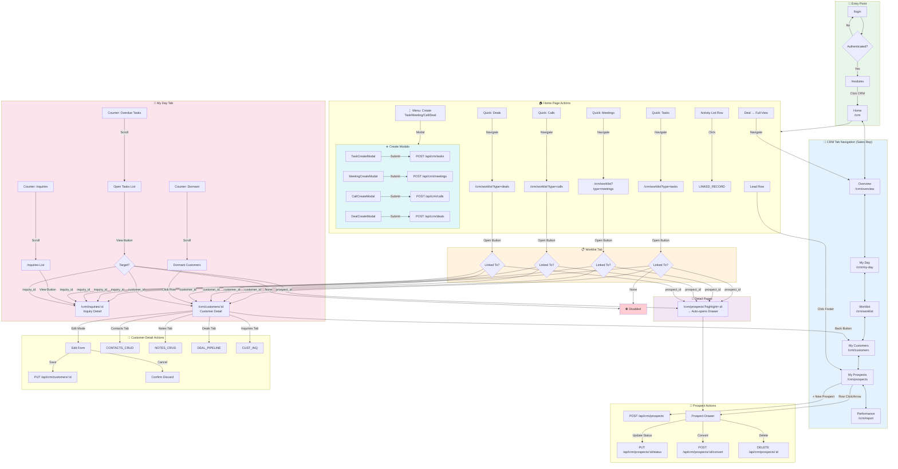
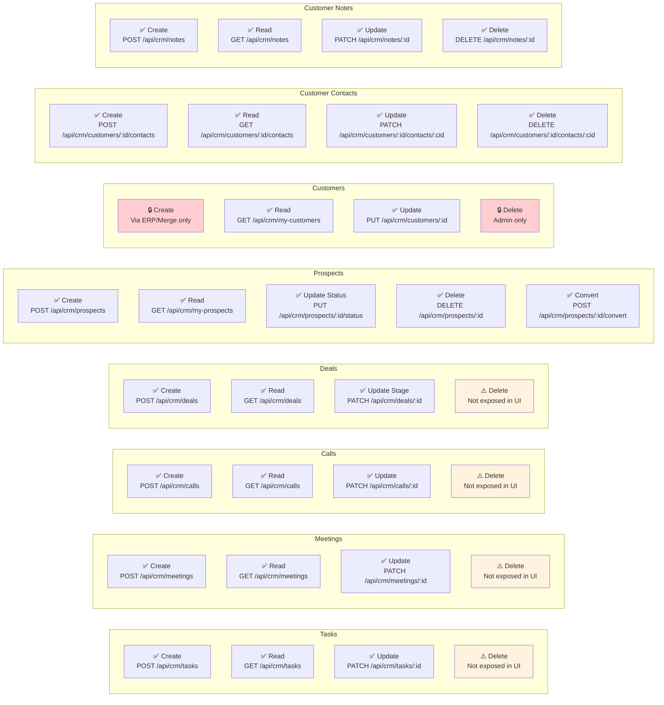
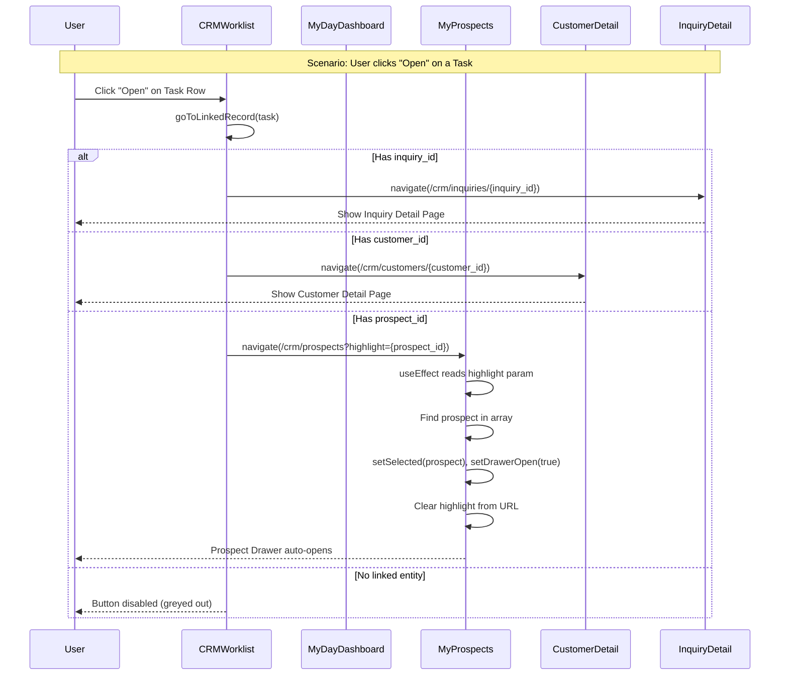
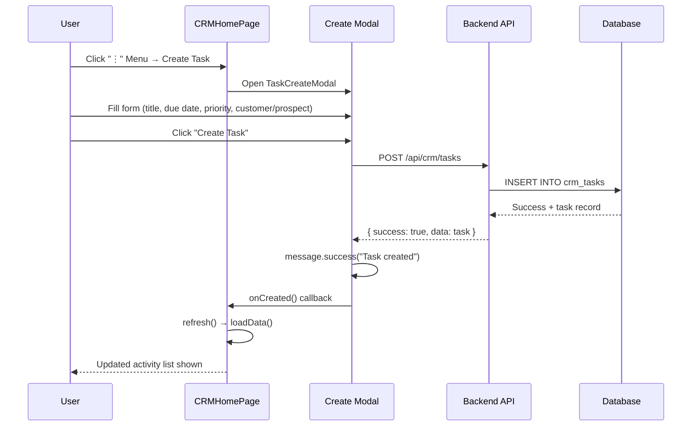
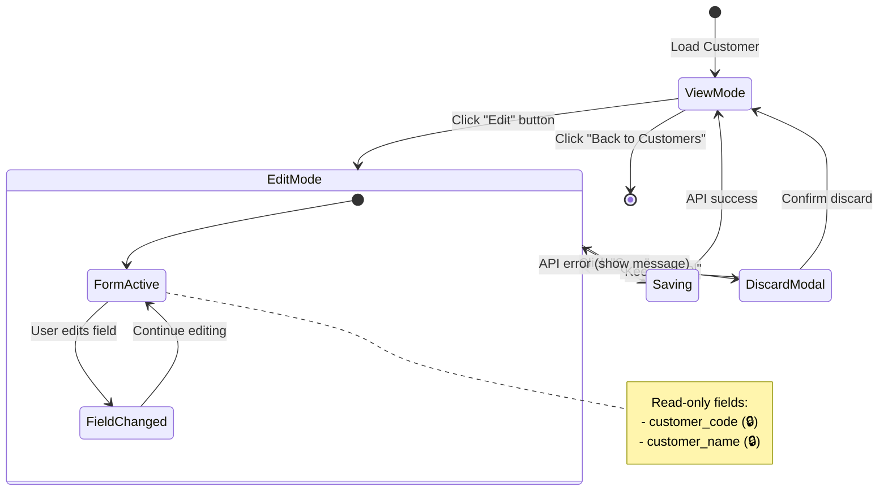
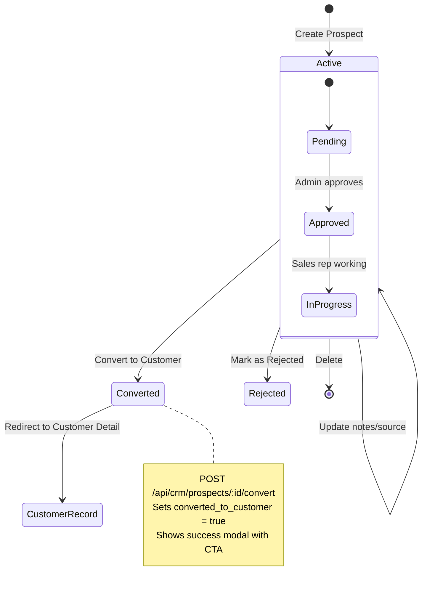

# CRM Module - Sales Rep Complete Workflow Diagram

> **Audit Date:** March 5, 2026  
> **Status:** ✅ All navigation flows verified  
> **Backend API:** ✅ Full CRUD coverage confirmed

---

## Master Navigation Flow

---

## Entity CRUD Matrix

---

## Deep Link Resolution Flow

---

## Activity Creation Flow

---

## Customer Edit Flow

---

## Prospect Lifecycle

---

## Backend API Coverage Summary

| Entity | Create | Read | Update | Delete | Notes |
|--------|--------|------|--------|--------|-------|
| **Tasks** | ✅ POST | ✅ GET | ✅ PATCH | ⚠️ API exists, UI hidden | Status: open/completed/overdue |
| **Meetings** | ✅ POST | ✅ GET | ✅ PATCH | ⚠️ API exists, UI hidden | Status: planned/held/not_held |
| **Calls** | ✅ POST | ✅ GET | ✅ PATCH | ⚠️ API exists, UI hidden | Direction: inbound/outbound |
| **Deals** | ✅ POST | ✅ GET | ✅ PATCH | ⚠️ API exists, UI hidden | Stages: qualified→won/lost |
| **Prospects** | ✅ POST | ✅ GET | ✅ PUT status | ✅ DELETE | Convert endpoint exists |
| **Customers** | 🔒 ERP only | ✅ GET | ✅ PUT | 🔒 Admin only | Editable fields limited |
| **Contacts** | ✅ POST | ✅ GET | ✅ PATCH | ✅ DELETE | Under customer context |
| **Notes** | ✅ POST | ✅ GET | ✅ PATCH | ✅ DELETE | Under customer context |
| **Activities** | ✅ POST | ✅ GET | — | — | Log-only (immutable) |
| **Worklist Prefs** | — | ✅ GET | ✅ PUT | ✅ DELETE | Per-user per-list-type |

---

## Issues Found & Fixed (This Session)

| Issue | Root Cause | Fix Applied |
|-------|-----------|-------------|
| Task "View" → `/crm/customers/undefined` | Missing validation for customer_id | Added `disabled` prop + priority logic |
| Prospect-linked items → generic list | No highlight param handling | Added `?highlight=` + auto-open drawer |
| MyProspects didn't auto-open drawer | Missing URL param listener | Added `useEffect` with `location.search` |

---

## Keyboard Shortcuts (CRMWorklist)

| Shortcut | Action |
|----------|--------|
| `/` | Focus search input |
| `Alt+1` | Switch to Tasks tab |
| `Alt+2` | Switch to Meetings tab |
| `Alt+3` | Switch to Calls tab |
| `Alt+4` | Switch to Deals tab |

---

## File Reference

| Component | File | Purpose |
|-----------|------|---------|
| Tab Router | [CRMModule.jsx](../src/components/CRM/CRMModule.jsx) | Main container, tab navigation |
| Home | [CRMHomePage.jsx](../src/components/CRM/CRMHomePage.jsx) | Daily planner, quick access, calendar |
| My Day | [MyDayDashboard.jsx](../src/components/CRM/MyDayDashboard.jsx) | Action counters, open tasks, inquiries |
| Worklist | [CRMWorklist.jsx](../src/components/CRM/CRMWorklist.jsx) | Unified list for tasks/meetings/calls/deals |
| Prospects | [MyProspects.jsx](../src/components/CRM/MyProspects.jsx) | Prospect management with drawer |
| Customer | [CustomerDetail.jsx](../src/components/CRM/CustomerDetail.jsx) | Full customer profile with tabs |
| Deals | [DealPipeline.jsx](../src/components/CRM/DealPipeline.jsx) | Kanban pipeline view |
| Create Task | [TaskCreateModal.jsx](../src/components/CRM/TaskCreateModal.jsx) | Task creation form |
| Create Meeting | [MeetingCreateModal.jsx](../src/components/CRM/MeetingCreateModal.jsx) | Meeting creation form |
| Create Call | [CallCreateModal.jsx](../src/components/CRM/CallCreateModal.jsx) | Call logging form |
| Create Deal | [DealCreateModal.jsx](../src/components/CRM/DealCreateModal.jsx) | Deal creation form |

---

> **Audit Result:** All navigation links, CRUD operations, and backend API endpoints verified for the Sales Rep CRM view. The system follows a consistent pattern where clickable items navigate to the appropriate detail page based on the linked entity type (inquiry → customer → prospect), with proper fallback handling when no link exists.
