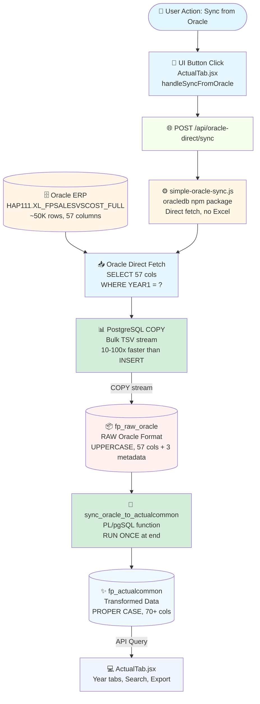
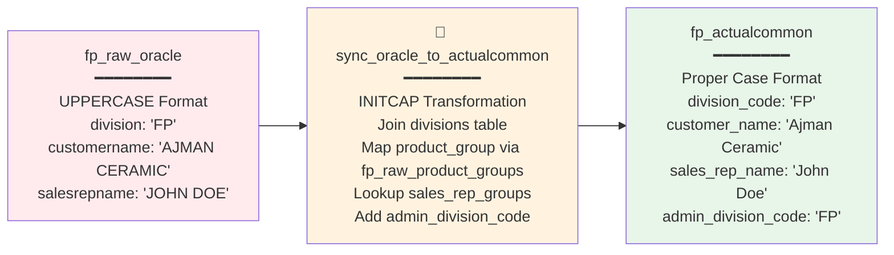
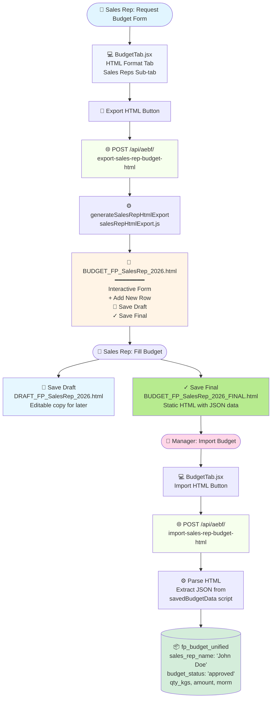
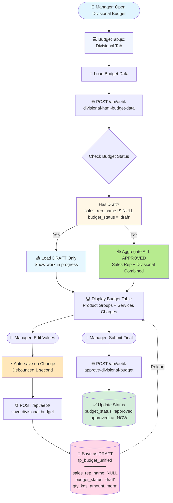
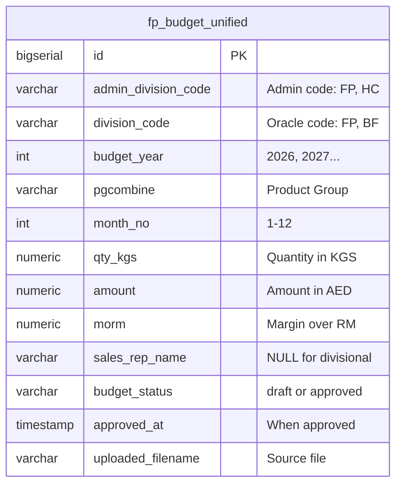
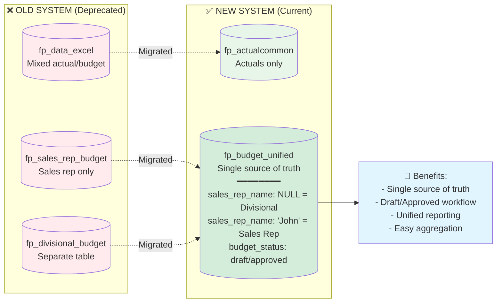

# IPD Data Management System - Complete Data Flow Diagrams

## 🎯 Overview

This document contains comprehensive Mermaid diagrams showing the complete data flow architecture of the IPD Data Management System. All diagrams reflect the **ACTUAL CURRENT IMPLEMENTATION** as of January 2026.

---

## 1. ACTUAL DATA FLOW

> **⚠️ UPDATED Feb 10, 2026**: Diagrams now reflect the current direct Oracle sync (no Excel).
> See `docs/ORACLE_ACTUAL_DATA_SYNC_GUIDE.md` for the complete reference.

### Complete Flow: Oracle → UI (CURRENT — Direct Sync)



### Legacy Flow (DEPRECATED — Excel-based, kept for reference)

The old flow went: Oracle → Manual Excel Export → Upload → import-excel-to-raw-fast.js → fp_raw_data → fp_actualcommon. This has been fully replaced by the direct sync above.

### Data Transformation Details



---

## 2. BUDGET DATA FLOW - SALES REP WORKFLOW

### Sales Rep Budget: HTML Export/Import



---

## 3. BUDGET DATA FLOW - DIVISIONAL WORKFLOW

### Divisional Budget: Live Editing with Draft/Approved States



### Budget Unified Table Structure



---

## 4. PRODUCT GROUP PRICING FLOW

### Pricing Data: Actuals → Materialized View → Budget Calculations

```mermaid
flowchart TD
    Actual[(📦 fp_actualcommon<br/>Actual Sales Data<br/>By Product Group)]
    MV[(🎯 fp_product_group_pricing_mv<br/>MATERIALIZED VIEW<br/>━━━━━━━━<br/>Per-KG Pricing by Year<br/>Avg Price = Amount / Qty)]
    Budget[💻 Budget Tab<br/>Calculate Amount & MoRM<br/>━━━━━━━━<br/>User enters MT<br/>Amount = MT × 1000 × Price<br/>MoRM = Amount × Material%]
    
    Refresh[🔄 Refresh MV<br/>Daily via cron<br/>or on-demand]
    
    Actual --> MV
    MV --> Budget
    Refresh -.->|Update| MV
    
    PricingLogic[Pricing Year Logic<br/>━━━━━━━━<br/>Budget 2024-2025: Use Actual Year<br/>Budget 2026+: Use (Budget Year - 1)]
    
    MV --> PricingLogic
    PricingLogic --> Budget
    
    style Actual fill:#e8f5e9
    style MV fill:#fff3e0
    style Budget fill:#f0f5ff
    style PricingLogic fill:#ffe7ba
```

---

## 5. DIVISION ARCHITECTURE

### Company Divisions: Oracle Code Mapping

```mermaid
flowchart TD
    Admin[🏢 company_divisions<br/>━━━━━━━━<br/>division_code: 'FP'<br/>division_name: 'Fine Paper'<br/>mapped_oracle_codes: ['FP' 'BF']<br/>is_active: true]
    
    Service[⚙️ divisionOracleMapping.js<br/>getDivisionOracleCodes<br/>Cached 5 minutes]
    
    Query[🔍 SQL Query Filter<br/>WHERE division_code = ANY(['FP' 'BF'])]
    
    Tables[(📊 Division Tables<br/>fp_actualcommon<br/>fp_budget_unified<br/>fp_raw_data)]
    
    Admin --> Service
    Service --> Query
    Query --> Tables
    
    Note[📝 Note: Supports multi-code divisions<br/>FB → FP Admin Division<br/>Denormalized in fp_actualcommon.admin_division_code]
    
    style Admin fill:#e1f5ff
    style Service fill:#fff3e0
    style Query fill:#f6ffed
    style Tables fill:#f0f5ff
    style Note fill:#fff4e6
```

---

## 6. COMPLETE SYSTEM OVERVIEW

### Full IPD Architecture: All Data Flows

```mermaid
flowchart TB
    subgraph External["🌐 External Sources"]
        Oracle[(Oracle ERP<br/>Sales Data)]
        SalesReps([👤 Sales Representatives<br/>Budget Input])
        Managers([👤 Division Managers<br/>Budget Review])
    end
    
    subgraph Import["📥 Data Import Layer"]
        Excel[Excel Files<br/>FPSALESVSCOST_FULL.xlsx]
        ImportScript[import-excel-to-raw-fast.js<br/>Batch Processing]
        HTMLImport[HTML Budget Import<br/>Sales Rep Forms]
    end
    
    subgraph Storage["💾 Database Layer"]
        RawData[(fp_raw_data<br/>Raw Oracle Data)]
        ActualCommon[(fp_actualcommon<br/>Transformed Actuals)]
        BudgetUnified[(fp_budget_unified<br/>Unified Budget Table)]
        PricingMV[(fp_product_group_pricing_mv<br/>Pricing Materialized View)]
        Divisions[(company_divisions<br/>Division Mappings)]
    end
    
    subgraph Transform["⚙️ Transformation Layer"]
        SyncFunc[sync_raw_to_actualcommon<br/>PostgreSQL Function]
        Trigger[after_fp_raw_data_change<br/>Auto-sync Trigger]
        RefreshMV[Refresh Pricing MV<br/>Daily Cron Job]
    end
    
    subgraph API["🌐 API Layer"]
        ActualAPI[/api/fp/<br/>Actual Data Endpoints]
        BudgetAPI[/api/aebf/<br/>Budget Endpoints]
        DivAPI[/api/divisions/<br/>Division Mappings]
    end
    
    subgraph Frontend["💻 Frontend UI"]
        ActualTab[ActualTab.jsx<br/>View/Export Actuals]
        BudgetTab[BudgetTab.jsx<br/>Divisional Budget]
        SalesRepTab[HTML Format Tab<br/>Sales Rep Budget]
        CompanySettings[CompanySettings.jsx<br/>Division Management]
    end
    
    %% External to Import
    Oracle -->|Manual Export| Excel
    Excel --> ImportScript
    SalesReps -->|Fill HTML Form| HTMLImport
    
    %% Import to Storage
    ImportScript --> RawData
    HTMLImport --> BudgetUnified
    
    %% Storage to Transform
    RawData --> Trigger
    Trigger --> SyncFunc
    SyncFunc --> ActualCommon
    ActualCommon --> RefreshMV
    RefreshMV --> PricingMV
    
    %% Storage to API
    ActualCommon --> ActualAPI
    BudgetUnified --> BudgetAPI
    PricingMV --> BudgetAPI
    Divisions --> DivAPI
    
    %% API to Frontend
    ActualAPI --> ActualTab
    BudgetAPI --> BudgetTab
    BudgetAPI --> SalesRepTab
    DivAPI --> CompanySettings
    
    %% Frontend to External
    BudgetTab -->|Export HTML| SalesReps
    BudgetTab -->|Approve Budget| Managers
    SalesRepTab -->|Export HTML| SalesReps
    
    style Oracle fill:#fff4e6
    style Excel fill:#f0f0f0
    style ImportScript fill:#fff7e6
    style RawData fill:#ffebee
    style ActualCommon fill:#e8f5e9
    style BudgetUnified fill:#e1f5ff
    style PricingMV fill:#fff3e0
    style SyncFunc fill:#d4edda
    style ActualTab fill:#f0f5ff
    style BudgetTab fill:#f0f5ff
```

---

## 7. KEY DIFFERENCES FROM OLD SYSTEM

### Migration Changes: Old vs. New Architecture



---

## 8. STATUS SUMMARY

### Implementation Status: What's Done vs. Pending

#### ✅ COMPLETED FEATURES

**Actual Data Flow:**
- ✅ Oracle Excel import (fast mode with trigger bypass)
- ✅ fp_raw_data → fp_actualcommon transformation
- ✅ Auto-sync trigger
- ✅ ActualTab UI with year tabs, search, export
- ✅ Division Oracle code mapping

**Budget Flow - Sales Rep:**
- ✅ HTML export with interactive form
- ✅ Save Draft / Save Final functionality
- ✅ HTML import with JSON data extraction
- ✅ Save to fp_budget_unified (approved status)

**Budget Flow - Divisional:**
- ✅ Draft/Approved workflow
- ✅ Live editing with auto-save
- ✅ Load draft OR aggregate approved budgets
- ✅ Product group + Services Charges support
- ✅ Pricing year logic (budgetYear - 1 for 2026+)
- ✅ Stored Amount/MoRM values (not just calculated)

**Fixes Applied (Jan 10-11, 2026):**
- ✅ Fixed undefined budgetUnified table name
- ✅ Fixed column mismatch (d.type → d.data_type)
- ✅ Fixed stored values not being used
- ✅ Fixed variable scope error (budgetDataDetailed)
- ✅ Fixed React useCallback stale closure
- ✅ Added data clearing before fetch

#### ⏳ PENDING / FUTURE ENHANCEMENTS

**Documentation:**
- ⏳ Document Estimate Tab functionality
- ⏳ Document Forecast Tab functionality
- ⏳ Add screenshots to PROJECT_RECAP.md
- ⏳ Create video tutorials for budget workflow

**Features:**
- ⏳ Bulk budget import from Excel (multi-sales-rep)
- ⏳ Budget comparison reports (Actual vs. Budget)
- ⏳ Historical budget versioning
- ⏳ Budget approval workflow with notifications
- ⏳ Mobile-responsive HTML budget forms

**Performance:**
- ⏳ Optimize pricing MV refresh (incremental updates)
- ⏳ Add more aggressive caching for budget queries
- ⏳ Implement batch save for large budget uploads

---

## 9. TECHNICAL NOTES

### Important Implementation Details

**Trigger Performance:**
- Import script DISABLES trigger during bulk insert
- Runs sync_raw_to_actualcommon() ONCE at end
- Performance: 3 rows/sec → 1,500 rows/sec improvement

**Budget Unified Logic:**
- `sales_rep_name IS NULL` = Divisional budget
- `sales_rep_name = 'John Doe'` = Sales rep budget
- `budget_status = 'draft'` = Work in progress
- `budget_status = 'approved'` = Finalized budget

**Pricing Year Logic:**
```javascript
const pricingYear = budgetYear >= 2026 ? budgetYear - 1 : actualYear;
// 2026 budget uses 2025 pricing
// 2024-2025 budget uses actual year pricing
```

**Division Mapping:**
- company_divisions.mapped_oracle_codes = ['FP', 'BF']
- Queries use: WHERE division_code = ANY(['FP', 'BF'])
- Cached for 5 minutes in divisionOracleMapping.js

**Data Transformation:**
- fp_raw_data: UPPERCASE (Oracle format)
- fp_actualcommon: Proper Case (INITCAP applied)
- All queries case-insensitive using UPPER()

---

## 10. FILE REFERENCE

### Key Files by Feature

**Actual Data Flow:**
- `import-excel-to-raw-fast.js` - Fast import script
- `server/routes/fp.js` - Actual data API endpoints
- `src/components/MasterData/AEBF/ActualTab.jsx` - Actual data UI
- `server/database/UniversalSalesByCountryService.js` - Sales queries

**Budget Flow:**
- `server/routes/aebf/divisional.js` - Divisional budget API
- `server/routes/aebf/sales-rep-budget.js` - Sales rep budget API
- `server/services/divisionalBudgetService.js` - Budget save logic
- `server/utils/divisionalHtmlExport.js` - HTML export generator
- `server/utils/salesRepHtmlExport.js` - Sales rep HTML export
- `src/components/MasterData/AEBF/BudgetTab.jsx` - Budget UI (8106 lines)

**Division Management:**
- `server/database/divisionOracleMapping.js` - Oracle mapping helper
- `migrations/321_enhanced_company_divisions_with_oracle_mapping.sql` - Division table

**Documentation:**
- `PROJECT_RECAP.md` - Main project documentation (1456 lines)
- `BUDGET-UNIFIED-MIGRATION-RECAP.md` - Budget migration details
- `DATA_FLOWS_MERMAID.md` - This file (Mermaid diagrams)

---

**Last Updated:** January 11, 2026  
**System Version:** Budget Unified Migration Complete  
**Total Fixes Applied:** 10 critical fixes + 4 enhancements
